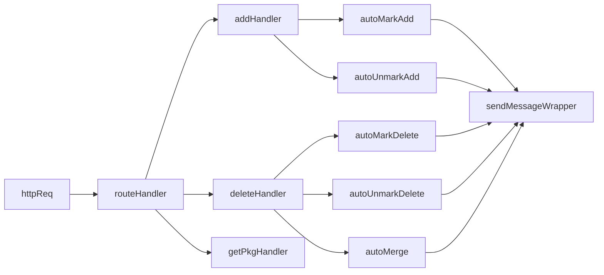
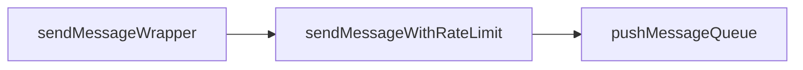
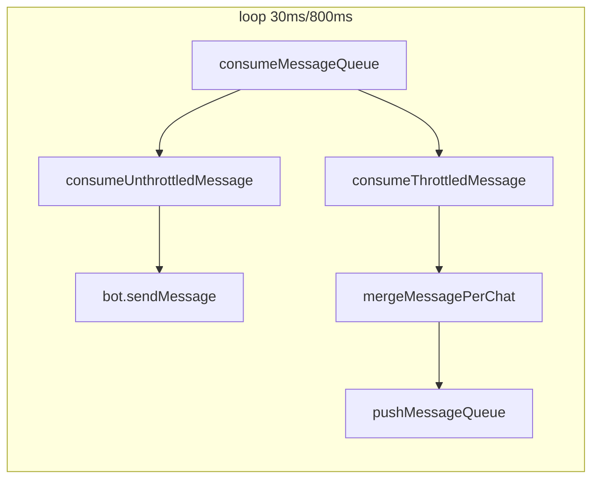

    Use Typora to preview this markdown file.

```mermaid
graph LR

A["httpReq"]-->B["routeHandler"]
B-->C["addHandler"]
B-->D["deleteHandler"]
B-->E["getPkgHandler"]
C-->F["autoMarkAdd"]
C-->G["autoUnmarkAdd"]
D-->H["autoMarkDelete"]
D-->I["autoUnmarkDelete"]
D-->N["autoMerge"]
N-->J
F-->J["sendMessageWrapper"]
G-->J
H-->J
I-->J
```

```mermaid
graph LR
A["sendMessageWrapper"]-->B["sendMessageWithRateLimit"]
B-->C["pushMessageQueue"]
```

```mermaid
graph LR
subgraph loop 30ms/800ms
A["consumeMessageQueue"]-->C["consumeUnthrottledMessage"]
C-->D["bot.sendMessage"]
A-->B["consumeThrottledMessage"]
B-->E["mergeMessagePerChat"]
E-->F["pushMessageQueue"]
end
```

